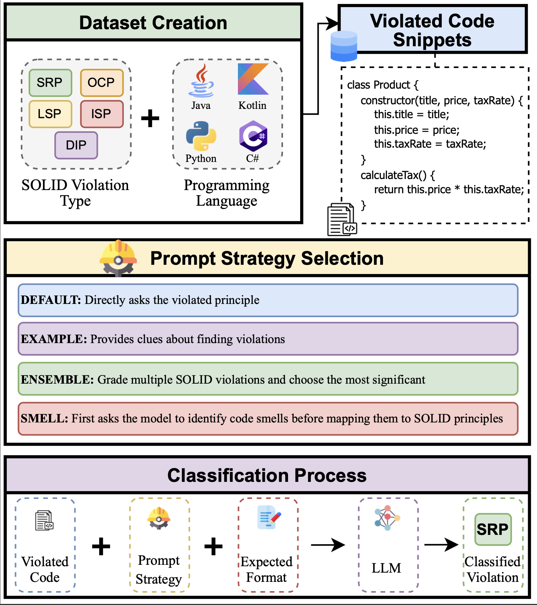
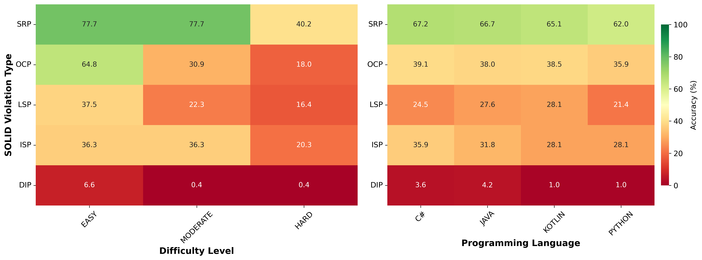
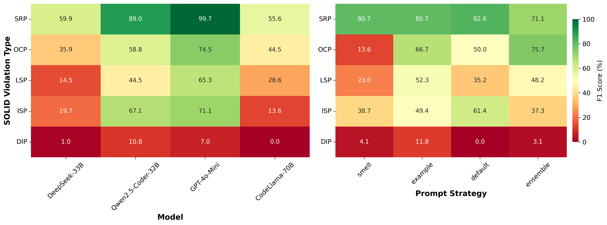

# Replication Package for 'Are We SOLID Yet?,' Submitted for ASE 2025 NIER

## Background & Motivation
Developers often overlook **SOLID principles**, leading to **maintainability** and **scalability** issues. While **LLMs** show promise in **code analysis**, their effectiveness in detecting and refactoring **OOP violations** remains unclear.

## Objectives
This project aims to develop a **locally deployable LLM-based tool** that detects and refactors violations in:

- **Single Responsibility Principle (SRP)**
- **Open-Closed Principle (OCP)**
- **Liskov Substitution Principle (LSP)**
- **Interface Segregation Principle (ISP)**
- **Dependency Inversion Principle**

Our goal is to systematically evaluate LLM performance across principles, programming languages, and prompt strategies.


## Dataset

We provide 240 synthetic examples covering all five SOLID principles, across:

- **4 programming languages**: Java, Python, Kotlin, and C#
- **3 difficulty levels**: Easy, Moderate, Hard
- **4 examples per principle × 3 levels × 4 languages**

### Table: Representative Scenarios Used to Generate SOLID Violation Examples in the Dataset

| **Principle** | **Violation Scenarios** |
|---------------|--------------------------|
| **SRP**       | *User Database:* A class handling both user persistence and email notifications. <br> *Salary Payslip:* An employee class calculating salary and printing pay slips. <br> *File Archiving:* A processor handling file content, archiving, and history tracking. <br> *Product Discount:* A product class applying discounts and managing display logic. |
| **OCP**       | *Payment Processing:* A processor requiring modification to add new payment methods. <br> *Customer Registration:* A service requiring changes to support new customer types. <br> *Document Notification:* A service requiring modification for new notification channels. <br> *Report Exporting:* An exporter requiring modification to add new export formats. |
| **DIP**       | *Email Service:* A service with a direct, hardcoded dependency on a `MySQLDatabase` class. <br> *Payment Processing:* A system tightly coupled to a specific `PayPalGateway`. <br> *File Processing:* A processor with hardcoded dependencies on file system operations. <br> *Notification System:* A service with a direct dependency on a `TwilioSMS` provider. |
| **LSP**       | *Vehicle Fuel System:* An `ElectricVehicle` subclass violating the expected `refuel()` behavior. <br> *Payment Processing:* A `CashProcessor` subclass improperly restricting valid payment amounts. <br> *Bird Flying Behavior:* A `Penguin` subclass breaking the inherited `fly()` contract. <br> *Document Processing:* A `ReadOnlyDocument` subclass breaking the inherited `save()` contract. |
| **ISP**       | *Game Development:* A mage class forced to implement an unused `meleeAttack()` method. <br> *Restaurant Management:* A waiter class forced to implement an irrelevant `cookFood()` method. <br> *Vehicle Control System:* A car class forced to implement an irrelevant `fly()` method. <br> *Music Player System:* A `CDPlayer` implementing a "fat" interface with unnecessary methods. |

### Methodology Overview



### Results




### Dataset Location

- Replication package of research part is located in `dataset/`
- Each `.json` file in `dataset/` includes 48 (4 Languages * 3 Difficulties * 4) records. Each record has only 1 violation and comes with its non violating version. These files are the manually prepared ground truth.
- `dataset/clean_code_pipeline.py`, `dataset/processing_pipeline.py` and `dataset/known_violation_pipeline.py` generates the files in `dataset/output/` using Refactoraptor API (with the server running locally) for all strategies. 
- `dataset/clean_code_pipeline.py` uses already clean code as input.
- `dataset/processing_pipeline.py` uses violated code without specifying ground truth violation. Generates files with the same names as those in `dataset/clean_code_pipeline.py`.
- `dataset/known_violation_pipeline.py` uses violated code and includes the ground truth violation type in the prompt.
- `dataset/creation_scenarios.md`: Describes the violation scenarios used to create the dataset.
- `dataset/groundtruth/`: Ground-truth labeled samples.
- `dataset/completions/test/`: LLM outputs on test examples.


## Evaluation Methodology

- Each sample’s detected violation is compared against its ground truth label.
- Performance metrics include **accuracy** and **F1-score**, broken down by model, principle, language, and difficulty.

### Evaluation Artifacts

- `evaluation_final/`: Contains all accuracy/F1 plots and CSVs by model, strategy, language, and level.
- `detailed_results_final.json`: Full sample-level results including model, strategy, expected/detected violations, language, and difficulty level.

## Steps to Reproduce:
- `dataset/clean_code_pipeline.py`, `dataset/processing_pipeline.py` and `dataset/known_violation_pipeline.py` generates the files in `dataset/output/` using Refactoraptor API (with the server running locally) for all strategies. 
- Then, run `manual_evaluation/violation_comparison.py` to search through the raw response of the models using our specified regex. This will produce a json file `detailed_results.json` for all the results, as well as `failed_extraction_for_review.json` and `multiple_violations_for_review.json` for manual review.
- After manual review, update the json file with the new violation_match entries by running `match_dataset.json`. This will result in the final json file ready for evaluation `detailed_results_final.json`.
- For evaluation, simple run `evaluation_final/final_analysis.py`. To trace every step of evaluation, you can also run `evaluation_final/evaluation_traceable/final_analysis_traceability.py`.


## Structure of the Project

```plaintext
REFACTORAPTOR/
├── __pycache__/                              # Python cache files
├── .idea/                                    # IDE configuration files
├── analytic_reports_trials/                  # Trials for output analysis (not used for final evaluation)
├── dataset/                                  # Core dataset and processing scripts
│   ├── groundtruth/                          # Ground-truth labeled samples
│   ├── completions/test/                     # LLM outputs on test examples
│   │   └── output/                           # Generated outputs from pipelines
│   ├── clean_code_pipeline.py                # Pipeline for clean code processing
│   ├── processing_pipeline.py                # Main processing pipeline
│   ├── known_violation_pipeline.py           # Pipeline with known violations
│   └── creation_scenarios.md                 # Violation scenarios documentation
├── evaluation_final/                         # Evaluation results and analysis
│   ├── evaluation_traceable/                 # Traceable evaluation scripts
│   ├── final_analysis.py                     # Main evaluation script
│   └── [accuracy/F1 plots and CSVs by model, strategy, language, level]
├── manual_evaluation/                        # Manual evaluation tools
│   ├── violation_comparison.py               # Regex-based violation detection
│   ├── failed_extraction_for_review_v5.json  # Outputs to be manually reviewed for failed extraction
│   ├── multiple_violations_for_review_v5.json # Outputs to be manually reviewed for multiple violations
│   └── SOLID_Violation_Cases_for_Manual_Review_complete.csv  # Completed manual review
├── plots/                                    # Generated visualization plots
├── viewer/                                   # Data visualization tools
├── calculate_metrics.py                      # Metrics calculation script
├── complexity_analysis_report.txt            # Complexity analysis results
├── cyclo_complexity.py                       # Cyclomatic complexity analysis
├── cyclomatic_complexity_results.csv         # Complexity results data
├── detailed_results_final.json               # Final output results after manual evaluation
├── llm-request.py                            # LLM API request handler
├── match_dataset.py                          # Dataset matching utilities
├── plot_dataset_analytics.py                 # Dataset analytics plotting
├── sequence.diagram.md                       # System sequence diagrams
└── README.md                                 # Project documentation
```


