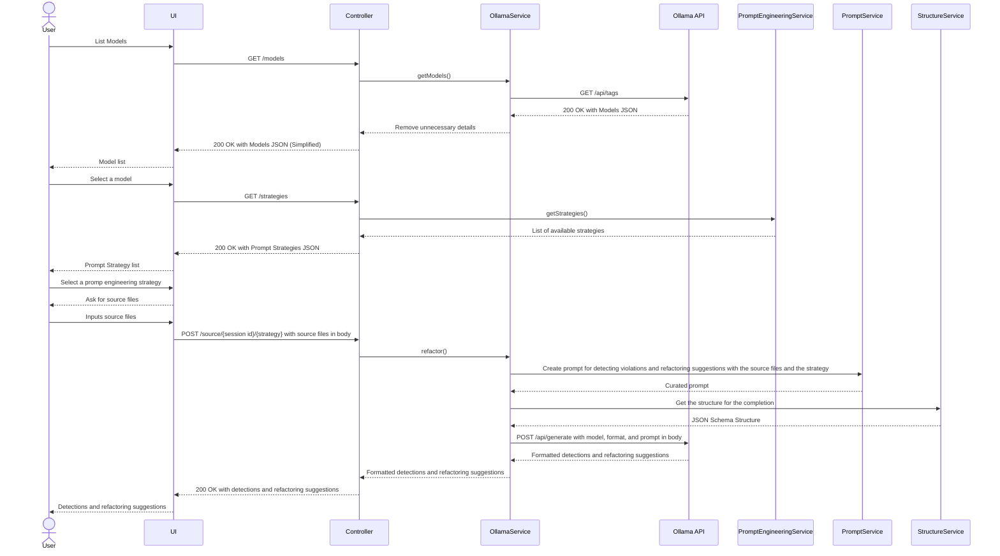

```mermaid
sequenceDiagram
    actor User
    User ->> UI: List Models
    UI ->> Controller: GET /models
    Controller ->> OllamaService: getModels()
    OllamaService ->> Ollama API: GET /api/tags
    Ollama API -->> OllamaService: 200 OK with Models JSON
    OllamaService -->> Controller: Remove unnecessary details
    Controller -->> UI: 200 OK with Models JSON (Simplified)
    UI -->> User: Model list
    User ->> UI: Select a model
    UI ->> Controller: GET /strategies
    Controller ->> PromptEngineeringService: getStrategies()
    PromptEngineeringService -->> Controller: List of available strategies
    Controller -->> UI: 200 OK with Prompt Strategies JSON
    UI -->> User: Prompt Strategy list
    User ->> UI: Select a promp engineering strategy
    UI -->> User: Ask for source files
    User ->> UI: Inputs source files
    UI ->> Controller: POST /source/{session id}/{strategy} with source files in body
    Controller ->> OllamaService: refactor()
    OllamaService ->> PromptService: Create prompt for detecting violations and refactoring suggestions with the source files and the strategy
    PromptService -->> OllamaService: Curated prompt
    OllamaService ->> StructureService: Get the structure for the completion
    StructureService -->> OllamaService: JSON Schema Structure
    OllamaService ->> Ollama API: POST /api/generate with model, format, and prompt in body
    Ollama API -->> OllamaService: Formatted detections and refactoring suggestions
    OllamaService -->> Controller: Formatted detections and refactoring suggestions
    Controller -->> UI: 200 OK with detections and refactoring suggestions
    UI -->> User: Detections and refactoring suggestions
```